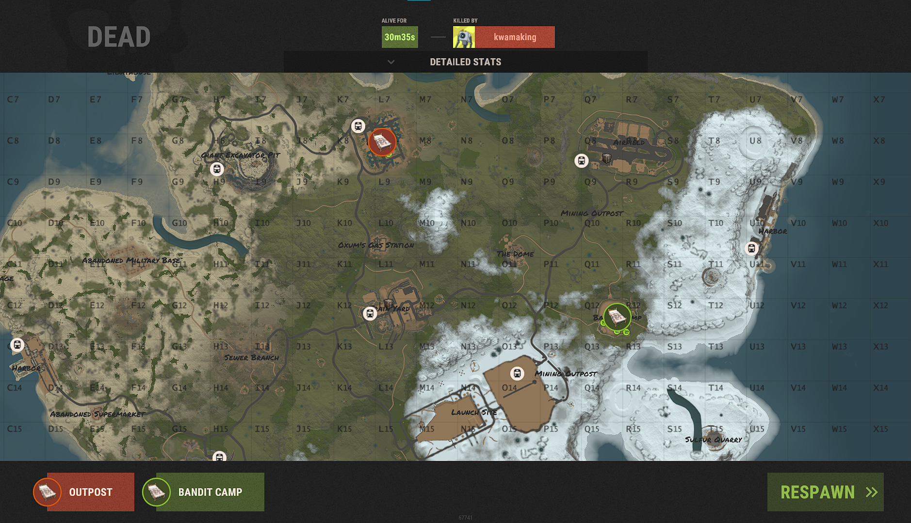

## Compound Teleport

Teleport through the death screen to Bandit Camp, Outpost, or any configured monument.

This plugin will do it's best to find a valid spawn location by a given monument prefab. If you've given a prefab and it can't find a valid spawn location, it will use the default player spawn.

I've had requests to be able to generate your own spawn locations with all of this same functionality, and while I could do that, I think it goes beyond the scope of this plugin and enters into areas that other plugins can already facilitate.

## Permissions

- `compoundteleport.use` - Turns this plugin on for the group or players assigned.

## Configuration

Configuration is optional, the example below will be autogenerated if none is provided. Not all monuments and prefabs have been tested, please use caution.

- `teleportLocations` - A list of teleport locations
- `name` - The nice display name of the Bed (SleepingBag) that displays on the death screen. Defaults to Outpost and Bandit Camp
- `timer` - The time in seconds before teleport location is able to be used again.
- `monumentPrefab` - the prefab of the monument or compound for the spawn location. Defaults to configuration below.
- `enabled` - Enable or disable this teleport location.

```json
{
  "teleportLocations": [
    {
      "name": "Outpost",
      "timer": 150,
      "monumentPrefab": "assets/bundled/prefabs/autospawn/monument/medium/compound.prefab",
      "enabled": true
    },
    {
      "name": "Bandit Camp",
      "timer": 150,
      "monumentPrefab": "assets/bundled/prefabs/autospawn/monument/medium/bandit_town.prefab",
      "enabled": true
    }
  ]
}
```

## Visual



## Credit

DezLife was the original author of this plugin.
